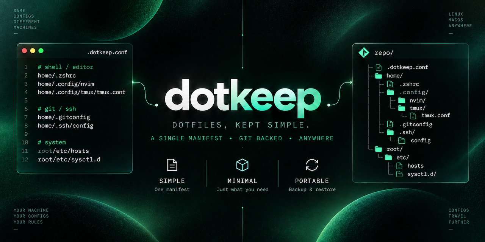

<div align="center">
  <h1>dotkeep</h1>
  
  <h4>Dotfiles, kept simple</h4>
  <br>
  <p>A single plain-text manifest for syncing configuration with Git</p>
</div>

## Install

Needs `bash`, `git`, `rsync`, `tree`, `tput`, `sed`, and GNU coreutils

```sh
git clone https://github.com/metaory/dotkeep
cd dotkeep
```

Symlink `dotkeep` into any directory on your `PATH`:

```sh
ln -s "$(realpath dotkeep)" /path/on/PATH/dotkeep
```

## Init

```sh
dotkeep init [DIR]
```

Creates `home/`, `root/`, empty `.dotkeep.conf`, a default `.gitignore`, and `git init`

> [!TIP]
>
> Or skip init: mkdir a dir and write `.dotkeep.conf` yourself
> Next: `cd` into that dir, edit `.dotkeep.conf`, then `dotkeep backup`

```sh
dotkeep init ~/state
cd ~/state
$EDITOR .dotkeep.conf
```

## Config

```sh
dotkeep config
```

Shows the full path to `.dotkeep.conf` and its contents

> [!NOTE]
> Plain file. One path per line. `#` comments
> Every entry must start with `home/` or `root/`

> [!CAUTION]
>
> No `~`, no absolute `/` forms, no `$VAR` expansion
> Prefer explicit files over whole dirs
> If both a dir and paths under it are listed, the dir wins and children are dropped

> [IMPORTANT]
>
> Symlinks are skipped (leaf and nested). Devices, fifos, and sockets are not synced
> Nested `.git` directories are stripped (content only, not repo metadata)
> Directory sync respects the state dir `.gitignore` (init seeds a Vite-style default)

Copy [dotkeep.conf.sample](dotkeep.conf.sample) or start from `dotkeep init`:

```sh
# shell / editor
home/.zshrc
home/.config/nvim
home/.config/tmux/tmux.conf

# git / terminal
home/.gitconfig
home/.config/starship.toml
home/.config/alacritty/alacritty.toml

# prefer files over whole dirs
home/.config/foo/config.toml
home/.config/foo/themes

# optional system paths
root/etc/hosts
```

```
home/.zshrc       is  $HOME/.zshrc
root/etc/hosts    is  /etc/hosts
```

## Where

`config` / `check` / `backup` / `restore` run from the dir that holds
`.dotkeep.conf`. No fixed path or name: pick any dir, any git remote

```
repo/
├── .dotkeep.conf
├── .gitignore
├── home/
└── root/
```

## Backup

```sh
dotkeep backup
```

Reads `.dotkeep.conf`. Copies each listed path from the live system
into this repo (`home/` and `root/`). Asks before writing

> Ignored paths under `home/` / `root/` are pruned via `git clean -X`
> Next: `git add` / `commit` yourself. Dotkeep does not commit

```sh
dotkeep check
dotkeep backup
git add -A
git commit -m snapshot
git push
```

## Restore

```sh
dotkeep restore
```

Reads `.dotkeep.conf`. Copies each listed path from this repo
(`home/` and `root/`) onto the live system. Asks before writing

> Existing live targets go to `/tmp/dotkeep.XXXXXX/` first

### New machine:

```sh
git clone <url> <state-dir>
cd <state-dir>
dotkeep restore
```

### Existing clone:

```sh
cd <state-dir>
git pull
dotkeep restore
```

## Commands

```
dotkeep <command>

init [DIR]   home/ root/ + empty .dotkeep.conf + .gitignore + git init
config       show .dotkeep.conf path + contents
check        validate + resolve paths
backup       copy live files into the repo
restore      copy repo files onto the live system
help
```

## Env

`NO_COLOR` disables color

## License

[MIT](LICENSE)
